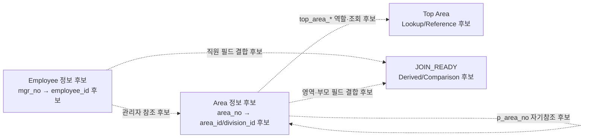

# 레거시 데이터 역공학 보고서

## 1. 개요

### 1.1 목적

본 보고서는 수집된 레거시 Flat 데이터를 분석하여 원본 데이터의 논리 구조와 관계 후보를 역공학한 결과를 정리한다.

분석 대상은 하나의 행에 영역, 부모·최상위 영역 후보, 관리자·직원 정보, 일시 값이 함께 들어온 Flat 관찰 데이터다. 반복되는 컬럼 묶음과 파일 역할은 다음 후보로 분리해 기록한다.

- 직원 정보 묶음 및 `employee` 모델 후보
- 업무 영역 정보 묶음 및 `area`/`division` 모델 후보
- `top_area_*`를 이용한 최상위 영역 Lookup·Reference 후보
- 영역·직원 값이 함께 펼쳐진 `join_ready` 파생·대조 후보

여기서 `Master`, `PK`, `FK`, 함수적 종속, 카디널리티는 DDL이나 업무 승인으로 확정된 사실이 아니다. 본문은 관찰값, 모델링 후보, 계획된 표준화, 현재 구현과 미구현 범위를 구분한다. Silver 계획의 네 출력 모델도 원본에 네 개의 독립 업무 테이블이 존재한다는 의미가 아니라, Phase 5에서 생성할 projection 후보의 수다.

---

## 2. 분석 대상 데이터

### 2.1 Raw Data 예시

| area_no | area_nm | p_area_no | p_area_nm | top_area_no | top_area_nm | top_area_lvl | mgr_no | mgr_nm | mgr_dept_nm | mgr_pos_nm | mgr_hire_dtm | mgr_act_yn | area_reg_dtm | top_area_reg_dtm |
|---|---|---|---|---|---|---|---|---|---|---|---|---|---|---|
| BIZ11608 | 보안관리 | BIZ00170 | 기획 | BIZ_00170 | 기획 | 최상위 | emp000038 | 이민서 | 분 석팀 | 팀장 | 2021-12-01T05:30:46+09:00 | 사용 | 2018-10-25T09:31:19+09:00 | 2019-11-04T00:52:02+09:00 |
| BIZ-31536 | 전략플랫폼 49 | BIZ_00379 | 인사 | BIZ_00379 | 인사 | TOP_LEVEL | EMP001103 | 김수아 | 생산팀 | 과장 | 2026-05-12T09:58:06+09:00 | 재직 | 2017-07-06T05:51:27+09:00 | 2021-11-28T04:43:22+09:00 |
| BIZ_00060 | 법무 |  |  | BIZ_00060 | 법무 | TOP_LEVEL | EMP000154 | 장시우 | 생산팀 | 사원 | 2016-08-17T11:48:00+09:00 | y | 2021-01-31T03:58:32+09:00 | 2023-06-12T08:30:00+09:00 |

Raw Data에서는 동일한 의미의 값이 서로 다른 표현 방식으로 저장되어 있었다.

대표적으로 다음과 같은 비표준성이 확인되었다.

- `BIZ11608`, `BIZ-31536`, `BIZ_00379` 등 영역 번호 형식 불일치
- `emp000038`, `EMP001103` 등 직원 번호 대소문자 불일치
- `분 석팀`과 같은 문자열 내부 불필요 공백
- `사용`, `재직` 등 동일한 상태 의미에 대한 표현 불일치
- `최상위`, `TOP_LEVEL` 등 코드값 표현 불일치
- 날짜·시간 값의 표현과 Timezone 포함 여부

이 값들은 표준화 대상 후보로 관찰되었다. 원본 값과 표준화 후보는 분리해 보존해야 하며, 전체 입력이 계획된 Silver Phase 4 계약으로 표준화 완료되었다고 이 보고서에서 주장하지 않는다.

### 2.2 현재 증거 범위

현재 checkout에서 확인 가능한 증거는 다음과 같다.

| 증거 | 확인값 | 의미·한계 |
|---|---:|---|
| Bronze/Raw 프로파일 행 수 | 8,344건 | `docs/Data/profile.md`에 기록된 입력 관찰 행 수 |
| 입력 wrapper | 6개 필드 | `record_id`, `payload`, `release_slot`, `scheduled_release_at`, `source_record_sha256`, `source_row_no` |
| 입력 payload | 15개 필드 | 영역·부모·최상위·관리자 정보를 담는 업무 필드 |
| 현재 Flat 산출물 | 8,147건 | `data/sample.csv`의 헤더를 제외한 행 수; Phase 4 출력과 동일한 계약으로 보지 않음 |
| 현재 Reject 산출물 | 197건 | `data/reject_rows.csv`의 헤더를 제외한 행 수; 8,147 + 197 = 8,344 |

`sample_data/sample_data.csv`와 `data/sample.csv`는 현재 작업 트리에서 확인되는 예시·Flat 산출물이다. 원천 DB DDL, 애플리케이션 Query, 원본 네 개 파일의 전체 스냅샷은 현재 checkout에서 확인되지 않는다. 따라서 아래의 파일 역할·건수는 과거 역공학 분석 기록과 현재 Bronze 프로파일을 같은 모집단으로 합산하지 않는다.

### 2.3 재계산 baseline evidence

2026-08-27 현재 checkout의 `data/sample.csv`와 `data/reject_rows.csv`를 직접 읽어 입력 결과를 재계산했다. `data/sample.csv`는 Accepted 8,147건, `data/reject_rows.csv`는 Reject 197건이며 두 결과의 합은 8,344건이다. 결합한 행의 `record_id`는 153751~162094 범위에서 8,344개가 모두 고유하고, `source_row_no`는 1~8,344가 모두 고유하다. `source_record_sha256`도 8,344개가 모두 고유하다.

이 재계산은 현재 checkout에 원본 Bronze 스냅샷 파일이 없기 때문에 결과 파일 기반 evidence다. 따라서 기획서에 적힌 Bronze 파일 SHA-256은 현재 실행으로 재현하지 못했으며, 8,344건이라는 수치도 원본 Bronze 바이트의 직접 검증이 아니라 Accepted·Reject 보존 결과의 합으로 기록한다.

baseline을 처음 계산할 당시 보고서는 736줄, SHA-256 `5f0c3303aeb6e58a204485fe2bdb3b5b0a273a91f4b587c4d0a8be09b698ed2e`였다. 1.3~1.7 정합화 내용을 반영한 현재 보고서는 758줄이다. 현재 파일의 SHA-256은 자기참조를 피하기 위해 `docs/Data/validation.json`과 착수 기록에 기록한다. 기획서의 730줄 및 별도 SHA-256 값은 이 checkout의 파일과 일치하지 않으므로 기준 증거로 사용하지 않는다.

### 2.4 증거 수준 분리

| 구분 | 현재 문서에서의 의미 | 처리 원칙 |
|---|---|---|
| 관측 | 파일·컬럼·값·행 수·해시처럼 현재 자료에서 직접 확인한 내용 | 근거 파일과 계산 결과를 함께 기록한다 |
| 추론 | 반복 패턴에서 도출한 직원·영역·부모·Join 관계 해석 | 후보·추정으로 표시하고 물리 제약으로 승격하지 않는다 |
| 후보 | 후속 모델·lookup·표준화에 사용할 수 있는 구조·식별자 | 승인 전 후보 상태를 유지한다 |
| 계약 결정 | Phase 1~4가 적용할 표준화·Reject·계층 경계 | 실행 완료나 업무 승인 완료와 혼동하지 않는다 |
| 실행 검증 | 실제 Phase 4 processor와 focused 테스트가 산출한 결과 | 확인한 코드·fixture·테스트 범위만 완료로 기록하고 전체 Bronze 실행으로 확대하지 않는다 |

현재 문서의 표준화 표현은 계약 목표 또는 관찰된 후보이며, 전체 Bronze가 Phase 4 표준화 완료되었다는 의미가 아니다.

### 2.5 승인된 Silver 결정과 영향 범위

다음 결정은 현재 v1 계약과 Phase 3~4 구현이 따르는 기준이다. `current`는 구현 계약의 현재 상태이고, 원본 업무 모델의 PK/FK나 전체 Bronze 처리 완료를 승인한다는 뜻은 아니다. `SDEC-008`은 식별자와 관계를 의도적으로 후보 상태로 유지한다.

| 결정 ID | 승인된 계약 기준 | 영향 필드·영역 | 연결 규칙 | 연결 엔터티·산출물 |
|---|---|---|---|---|
| `SDEC-001` | 원천 한 행은 조직과 직원 후보의 관측 한 건 | `grain` | `BR-001`, `BR-002`, `BR-003` | `employee`, `division`, 관계·파생 후보 |
| `SDEC-002` | `records.json`은 공식 CSV 기준선이 아닌 보조 레거시 입력 | `input_wrapper`, 입력 범위 | `BR-007`, `BR-008` | `join_ready_snapshot`, `top_division_lookup` |
| `SDEC-003` | 승인된 payload 15개를 표준 업무 필드 15개로 매핑 | 모든 표준 업무 필드 | `BR-002`, `BR-003`, `BR-006` | `employee`, `division`, Phase 4 accepted record |
| `SDEC-004` | 승인 패턴만 `BIZ_#####`와 canonical 조직명으로 변환 | `area_*`, `parent_area_*`, `top_area_*` 이름·ID | `BR-009`, `BR-010` | `division`, `division_hierarchy`, `top_division_lookup` |
| `SDEC-005` | 상태는 `ACTIVE`/`INACTIVE`, 일시는 서울 기준 naive `%Y-%m-%dT%H:%M:%S` | `employee_status_code`, 세 일시 필드 | `BR-011`, `BR-012` | `employee`, `division`, top lookup projection |
| `SDEC-006` | Top Area는 lookup/reference이며 최상위·부모 null 규칙을 검증 | `parent_area_*`, `top_area_*`, `top_area_level_code` | `BR-005`, `BR-006`, `BR-008`, `BR-016`, `BR-019` | `division`, `division_hierarchy`, `top_division_lookup` |
| `SDEC-007` | 오류 행은 원문·lineage·모든 위반 사유와 함께 Reject | 전체 업무 필드, wrapper, accounting | `BR-001`, `BR-009`, `BR-010` | Phase 4 accepted/rejected disposition |
| `SDEC-008` | 식별자·관계·카디널리티는 후보로 추적하며 확정 PK/FK로 표현하지 않음 | `grain`, `area_id`, `parent_area_id`, `top_area_id`, `employee_id` | `BR-004`, `BR-005`, `BR-014`~`BR-019` | `employee`, `division`, 관계·파생 후보 |

---

## 3. 전처리 결과

이 절의 표는 Silver Phase 3~4 구현이 적용하는 변환 기준을 요약한다. 현재 checkout에는 `src/silver/standardization/` 구현, v1 계약·schema·mapping·fixture·contract lock과 focused 계약 테스트가 존재한다. 다만 현재의 `data/sample.csv` 8,147건과 `data/reject_rows.csv` 197건을 이 processor로 다시 생성했다는 실행 증거는 확인되지 않았다.

### 3.1 주요 표준화 후보

| 대상 | Raw 예시 | 현재 Phase 4 계약·구현 기준 |
|---|---|---|
| 영역 번호 | `BIZ11608`, `BIZ-31536` | 승인된 패턴에 한해 `BIZ_#####` 후보로 변환; 충돌은 병합하지 않음 |
| 직원 번호 | `emp000038` | 승인된 패턴에 한해 `EMP######` 후보로 변환; 원본 값은 보존 |
| 이름·부서·직위 | `분 석팀`, 외곽 공백 | 일반 텍스트는 외곽·전각 공백만 정리하고 내부 공백은 보존 |
| 상태 코드 | `사용`, `재직`, `y`, `1` | 승인된 값만 `ACTIVE`/`INACTIVE`로 변환하고 unknown은 Reject |
| 최상위 레벨 | `최상위`, `TOP_LEVEL`, `1`, `L1` | 승인된 값만 `TOP_LEVEL`로 변환하고 unknown은 Reject |
| Datetime | 여러 날짜·시간 형식과 `+09:00` | naive는 서울 시각으로 해석하고 offset 값은 서울로 변환한 뒤 `%Y-%m-%dT%H:%M:%S`로 출력 |

Phase 4는 wrapper·payload 구조 오류를 행 Reject로 보존하고, 정상 후보에 위 표준화와 계층·충돌 검증을 적용해 `Phase4Output`을 만든다. Phase 5는 이 변환을 다시 수행하지 않고 이미 표준화된 15개 business 필드를 소비한다. focused 계약 테스트는 공개 binding으로 실제 `Phase4Processor` 출력을 `Phase5Processor`가 별도 필드 변환 없이 읽는 경계를 확인한다.

Phase 1~4 계약 기준에서는 상태 출력 코드를 `ACTIVE` 또는 `INACTIVE`로 제한하고, 업무 일시는 서울 시각으로 해석한 뒤 offset을 제거한 `%Y-%m-%dT%H:%M:%S`로 표현한다. `Top Area`는 독립 Master가 아니라 전체 snapshot을 참조하는 Lookup/Reference로 검증한다. 이는 코드·focused 테스트로 확인된 구현 경계이며 전체 Bronze 8,344건 처리 완료를 뜻하지 않는다.

---

# 4. 원본 파일 구조 분석

과거 역공학 분석에서 기록된 파일 역할은 다음과 같다. 현재 checkout에는 표의 네 원본 파일이 존재하지 않으므로 건수는 현재 실행으로 재검증한 값이 아니다.

| 역공학 분석에 기록된 파일 | 기록된 데이터 행 수 | 기록된 컬럼 수 | 역할 후보 |
|---|---:|---:|---|
| `biz_employee_master.csv` | 3,000 | 6 | 직원 Master 후보 |
| `biz_meta_area_50000.csv` | 50,000 | 5 | 업무 영역 Master 후보 |
| `biz_meta_area_join_ready.csv` | 50,000 | 9 | 업무 영역과 직원 정보를 결합한 파생·대조 후보 |
| `biz_meta_area_parent_lookup.csv` | 1,000 | 4 | 최상위 업무 영역 Lookup 후보 |
| **기록 합계** | **104,000** | **24** | 현재 Bronze 8,344건과 동일 모집단이라는 뜻이 아님 |

파일별 컬럼 구성을 분석한 결과, 모든 파일이 동일한 수준의 원천 데이터를 저장하는 것은 아닌 것으로 판단하였다.

특히 `employee_master`와 `meta_area`는 각각 식별자처럼 반복되는 컬럼과 속성 묶음을 보여 **Master 후보**의 특성을 보였다. 반복 패턴만으로 실제 PK나 DB Master 테이블을 확정하지 않는다.

반면 `join_ready`는 다른 후보 묶음과 겹치는 값이 함께 나타나므로 독립 업무 개체보다는 **파생·대조 데이터 후보**로 분류한다. 생성 Query, 저장 시점, 전체 grain은 확인되지 않았다.

---

# 5. 역공학 접근 방법

## 5.1 핵심 키 후보 탐색

테이블 구조를 알 수 없는 상태에서 가장 먼저 수행한 작업은 컬럼 가운데 각 업무 개체를 식별할 가능성이 있는 후보를 찾는 것이었다. 유일성·불변성·필수성·표현 차이의 동일성은 별도 검증 대상이다.

분석 결과 다음 두 컬럼을 핵심 식별자 후보로 기록하였다.

- `mgr_no`
- `area_no`

`mgr_no`는 직원 이름·부서·직위·입사일·상태 후보와 함께 반복적으로 나타나 직원 식별자 후보로 사용할 수 있다. 그러나 공식 직원 키인지, 표기 변형이 같은 ID인지, 전체 범위에서 유일한지는 확인 전이다.

`area_no` 역시 영역명·상위 영역 번호·관리자 번호·등록 일시 후보와 함께 나타나 영역 식별자 후보로 사용할 수 있다. 구분자·대소문자 차이로 인한 충돌과 전체 유일성은 확인 전이다.

따라서 다음과 같은 두 개의 핵심 Entity 후보를 먼저 복원하였다.

```text
mgr_no
   ↓
Employee 후보

area_no
   ↓
Area 후보
```

이 두 Entity를 중심으로 나머지 컬럼과 파일의 관계를 분석하였다.

---

# 6. 복원한 테이블

## 6.1 BIZ_EMPLOYEE_MASTER

### 역할

`BIZ_EMPLOYEE_MASTER`는 직원 및 관리자 정보가 함께 관찰된 **직원 Master 후보**로 분류한다. 현재 보고서만으로 실제 원천 테이블이나 PK를 확정하지 않는다.

### 복원 근거

`mgr_no`를 기준으로 다음 속성이 반복적으로 함께 나타났다. 이는 현재 스냅샷에서의 관찰된 묶음이지, 원본 DB의 함수적 종속을 증명하는 것은 아니다.

- `mgr_nm`
- `mgr_dept_nm`
- `mgr_pos_nm`
- `mgr_hire_dtm`
- `mgr_act_yn`

따라서 다음과 같은 함수적 종속 후보를 조사할 수 있다.

```text
mgr_no
  ├─ mgr_nm
  ├─ mgr_dept_nm
  ├─ mgr_pos_nm
  ├─ mgr_hire_dtm
  └─ mgr_act_yn
```

따라서 `mgr_no`를 표준 `employee_id`로 연결할 식별자 후보로 기록하였다. 공식 직원 키 여부와 Primary Key 제약은 미확정이다.

### 논리 구조

| 컬럼 | 역할 |
|---|---|
| `mgr_no` | `employee_id` 연결 후보; PK 미확정 |
| `mgr_nm` | 직원명 |
| `mgr_dept_nm` | 소속 부서명 |
| `mgr_pos_nm` | 직급 |
| `mgr_hire_dtm` | 입사일시 |
| `mgr_act_yn` | 직원 상태 코드 후보; 의미 미확정 |

해당 컬럼 묶음은 다른 영역 후보에서 관리자 정보를 참조할 때 사용할 수 있는 **직원 정보 기준 후보**다. 부서·직위의 업무 정의와 상태 코드의 의미는 별도 확인이 필요하다.

---

## 6.2 BIZ_META_AREA

### 역할

`BIZ_META_AREA`는 조직 또는 업무 영역의 기본 정보가 관찰된 **업무 영역 Master 후보**로 분류한다. `area`와 `division`은 후속 Silver 명명에서 연결될 수 있는 논리명 후보이며, 실제 원천 테이블명은 확정하지 않는다.

### 복원 근거

`area_no`를 중심으로 다음 값이 반복적으로 함께 나타났다. 이를 영역 식별자 후보와 속성 후보의 묶음으로 기록하며 실제 함수적 종속은 검증 전이다.

```text
area_no
  ├─ area_nm
  ├─ p_area_no
  ├─ mgr_no
  └─ area_reg_dtm
```

따라서 `area_no`를 표준 `area_id`/`division_id`로 연결할 식별자 후보로 기록하였다. Primary Key 제약은 확정하지 않는다.

### 논리 구조

| 컬럼 | 역할 |
|---|---|
| `area_no` | `area_id`/`division_id` 연결 후보; PK 미확정 |
| `area_nm` | 업무 영역명 |
| `p_area_no` | 상위 영역 ID 후보; 자기참조 FK 미확정 |
| `mgr_no` | 관리자·직원 참조 후보; FK 미확정 |
| `area_reg_dtm` | 업무 영역 등록 일시 후보 |

특히 `mgr_no`가 직원 정보 묶음과 영역 정보 묶음에 함께 나타나므로 직원-영역 관리자 관계 후보를 세울 수 있다. 한 직원이 여러 영역을 관리하는 카디널리티는 관찰·업무 확인 전에는 확정하지 않는다.

```text
EMPLOYEE 1 : N AREA (관계 추정)
```

또한 `p_area_no`가 `area_no`와 연결될 수 있는 형태를 보이므로 업무 영역 내부 자기참조 관계 후보를 기록하였다. 표기 정규화 후의 동일성, 루트·고아·순환 규칙은 아직 미결정이다.

```text
AREA
 ├─ 상위 AREA
 │    └─ 하위 AREA
 │         └─ 하위 AREA
```

따라서 `BIZ_META_AREA`는 계층형 구조를 표현할 가능성이 있는 영역 후보 데이터다. 실제 계층 제약은 전체 snapshot 검증과 업무 확인이 필요하다.

---

# 7. 계층 관계 분석

`BIZ_META_AREA`에서 확인할 핵심 관계 후보 중 하나는 다음과 같다.

```text
area_no → p_area_no
```

다음은 필드 의미를 설명하기 위한 예시이며, 현재 전체 원천에서 확인된 특정 행을 뜻하지 않는다.

```text
BIZ_00170 | 기획
    ↑
BIZ_11608 | 보안관리
```

`BIZ_11608` 행의 `p_area_no`가 `BIZ_00170`이라면 다음과 같이 해석할 수 있다.

```text
기획
└── 보안관리
```

따라서 `p_area_no`는 다른 `BIZ_META_AREA.area_no`를 참조할 수 있는 Self FK 후보다.

논리적인 관계는 다음과 같다.

```text
BIZ_META_AREA.area_no
        ↑
        │
BIZ_META_AREA.p_area_no
```

이를 통해 원본 시스템이 업무 영역을 Tree 또는 Hierarchy로 관리했을 가능성을 제기할 수 있다. 다만 부모 존재성·self-reference·cycle 여부는 계획된 전체 ReferenceSnapshot/Reconciler 검증 없이는 확정하지 않는다.

---

# 8. BIZ_META_AREA_PARENT_LOOKUP

## 8.1 역할

`BIZ_META_AREA_PARENT_LOOKUP`은 업무 영역의 최상위 역할을 조회하기 위한 **Lookup/Reference 후보**로 판단하였다. 이 파일 또는 행이 독립적인 핵심 업무 엔터티라는 뜻은 아니다.

### 논리 구조

| 컬럼 | 역할 |
|---|---|
| `top_area_no` | 최상위 영역 ID 후보 |
| `top_area_nm` | 최상위 영역 이름 후보 |
| `top_area_lvl` | 계층 수준 코드 후보 |
| `top_area_reg_dtm` | 최상위 역할의 등록 일시 후보 |

이 테이블은 컬럼명 자체가 비교적 직접적인 단서를 제공하므로 다른 파일보다 역할 후보를 정리하기 쉬웠다.

특히 다음 컬럼들이 직접적인 단서를 제공하였다.

```text
top_area_no
top_area_nm
top_area_lvl
```

`top_area_lvl`에는 `TOP_LEVEL`뿐 아니라 `top_level`, `TOP LEVEL`, `1`, `L1` 등의 표현도 관찰된다. 컬럼명과 값은 최상위 역할 후보를 지지하지만, 값만으로 Root 노드·독립 엔터티·상태 매핑을 확정할 수 없다.

---

## 8.2 별도 Lookup Table이 존재하는 이유

`BIZ_META_AREA_PARENT_LOOKUP`은 계층 탐색 또는 정제·조인 과정에서 최상위 영역 역할을 빠르게 조회하기 위한 **참조용 데이터셋일 가능성**이 있다. 실제 생성 목적과 유지 주기는 확인되지 않았다.

---

# 9. BIZ_META_AREA_JOIN_READY 분석

전체 역공학 과정에서 가장 해석이 필요했던 파일은 `biz_meta_area_join_ready.csv`였다.

이 데이터에는 다음과 같은 정보가 함께 존재한다.

```text
Area 정보
 ├─ area_no
 ├─ p_area_no
 └─ p_area_nm

Employee 정보
 ├─ mgr_no
 ├─ mgr_nm
 ├─ mgr_dept_nm
 ├─ mgr_pos_nm
 ├─ mgr_hire_dtm
 └─ mgr_act_yn
```

독립된 Entity로 확정하기에는 영역·직원 정보 후보와 겹치는 값이 상당수 함께 나타난다.

따라서 해당 데이터는 Master Table보다 **영역·직원 정보를 펼친 파생·대조 데이터 후보**로 분류한다. 실제로 어떤 테이블을 어떤 Query로 조인했는지와 저장 시점은 확인되지 않았다.

---

## 9.1 추정 생성 과정

필드 구성만으로 가능한 생성 과정의 후보는 다음과 같다.

```text
BIZ_META_AREA 후보
      │
      │ mgr_no
      ▼
BIZ_EMPLOYEE_MASTER 후보
      │
      │
      ├─────────────┐
      │             │
      │ p_area_no   │
      ▼             │
Parent Area 정보 후보  │
      │             │
      └──────┬──────┘
             ▼
BIZ_META_AREA_JOIN_READY 후보
```

보다 구체적으로는 다음과 같은 형태이다.

```text
AREA
  + EMPLOYEE
  + PARENT AREA NAME
       ↓
JOIN_READY
```

즉 하나의 `area_no`를 기준으로 관리자와 상위 영역 관련 필드를 한 행에서 확인하도록 구성했을 가능성이 있다. 이 해석은 파생 후보의 grain과 Query가 확인된 뒤에 확정할 수 있다.

---

# 10. JOIN_READY의 목적에 대한 해석

`JOIN_READY`라는 이름과 데이터 구조를 종합하면 이 파일은 단순 Master라기보다 **조인 결과를 대조하거나 후속 처리에 사용할 수 있는 중간 결과 데이터셋 후보**로 해석하는 것이 자연스럽다. 다만 이름과 중복 필드만으로 실제 운영 목적을 확정하지 않는다.

특히 다음 특징이 이를 뒷받침한다.

### 1. Area와 Employee의 관계가 명시적으로 펼쳐져 있다.

정규화된 구조라면 다음과 같은 후보 참조를 별도로 조회할 수 있다.

```text
AREA.mgr_no
     ↓
EMPLOYEE.mgr_no
```

하지만 `JOIN_READY`에서는

```text
area_no
mgr_no
mgr_nm
mgr_dept_nm
mgr_pos_nm
...
```

이 모두 하나의 행에 존재한다.

따라서 특정 업무 영역과 직원 정보가 한 행에 함께 나타나는 대조 형태로 사용할 수 있다.

---

### 2. 직원 정보가 Snapshot 형태로 복제되어 있다.

`mgr_nm`, `mgr_dept_nm`, `mgr_pos_nm`, `mgr_hire_dtm`, `mgr_act_yn`은 직원 정보 묶음 후보와 겹치는 값이다.

이 값이 다시 나타난다는 것은 `JOIN_READY`가 직원 정보를 직접 관리하는 Master가 아니라 특정 시점의 조인 결과를 보존한 **Snapshot-like 또는 Denormalized Dataset 후보**일 가능성을 높인다. 기준 시점·보존 주기·갱신 방식은 확인되지 않았다.

---

### 3. 상위 영역명까지 포함한다.

`p_area_no`뿐만 아니라 `p_area_nm`까지 함께 존재한다.

정규화된 후보 모델에서는 보통 다음과 같은 자기참조 조회가 필요할 수 있다.

```text
Child Area
   │
   │ p_area_no
   ▼
Parent Area
   │
   └─ area_nm
```

`JOIN_READY`에는 Parent Area 이름 후보도 함께 나타난다.

따라서 이 데이터는 다음 두 가지 관계 후보를 한 행에 펼친 결과일 수 있다.

```text
Area → Manager

Area → Parent Area
```

---

# 11. JOIN_READY의 추정 업무적 역할

이를 종합하면 `BIZ_META_AREA_JOIN_READY`의 관찰 기반 역할 후보는 다음과 같이 정의할 수 있다.

> **업무 영역을 기준으로 직원 정보 및 상위 영역 관련 필드를 함께 보관하여 후보 참조를 대조하거나 후속 처리에 사용할 수 있는 비정규화된 파생 데이터셋**

특히 역공학 관점에서는 이 파일이 중요한 단서가 되었다.

`JOIN_READY`에 다음 값이 함께 존재한다는 사실 자체가

```text
area_no
mgr_no
mgr_nm
p_area_no
p_area_nm
```

원본 데이터에 적어도 다음과 같은 관계 후보를 조사할 단서가 있음을 보여주기 때문이다.

```text
AREA ───── MANAGER
 │
 └──────── PARENT AREA
```

즉 `JOIN_READY`는 단순히 중복 데이터를 모아놓은 파일이라기보다 **후보 관계를 펼쳐 보여주는 파생·대조 데이터**로 해석할 수 있다.

이러한 특성 때문에 원본 Schema가 제공되지 않은 상황에서도 Employee와 Area 사이의 관계 후보를 세우는 근거로 사용할 수 있다. 이것만으로 실제 FK나 참조 무결성이 증명되지는 않는다.

---

# 12. Master Table과 파생 테이블 구분

역공학 결과 파일은 증거 수준을 고려해 다음과 같이 구분하였다.

| 테이블 | 분류 | 판단 근거 |
|---|---|---|
| `BIZ_EMPLOYEE_MASTER` | Master 후보 | `mgr_no`와 직원 속성 후보가 함께 나타남; 실제 PK·테이블은 미확정 |
| `BIZ_META_AREA` | Master 후보 | `area_no`와 영역 속성·참조 후보가 함께 나타남; 실제 PK·테이블은 미확정 |
| `BIZ_META_AREA_PARENT_LOOKUP` | Lookup / Reference 후보 | `top_area_*`가 최상위 역할·조회 정보를 나타낼 가능성 |
| `BIZ_META_AREA_JOIN_READY` | Derived / Comparison 후보 | Area·Employee·Parent 관련 값이 중복 결합됨 |

전체 데이터 구조는 다음과 같이 해석할 수 있다.

```text
                 ┌─────────────────────┐
                 │ EMPLOYEE 후보       │
                 │ key: mgr_no 후보    │
                 └─────────┬───────────┘
                           │
                           │ manager reference candidate
                           ▼
                 ┌─────────────────────┐
                 │ AREA 후보           │
                 │ key: area_no 후보   │
                 │ ref: mgr_no 후보    │
                 │ ref: p_area_no 후보 │
                 └──────┬────────┬─────┘
                        │        │
           self relation│        │top area
                        │        │
                        ▼        ▼
                   AREA 후보    PARENT LOOKUP 후보
                        │
                        └───┬
                            │
                            ▼
                 ┌─────────────────────┐
                 │ AREA_JOIN_READY 후보 │
                 │ Derived / Comparison│
                 └─────────────────────┘
```

---

## 12.1 Silver 계획과 현재 구현의 경계

역공학 후보와 Silver 구현 상태를 혼동하지 않기 위해, 첨부된 Silver 구현 계획과 현재 checkout을 다음처럼 구분한다.

| 범위 | 계획의 목표 | 현재 checkout에서 확인된 상태 | 판정 |
|---|---|---|---|
| Plan 1, Phase 1~4 | 원천 wrapper·payload 검증, 15개 business 필드 표준화, 행 Reject, `Phase4Output` 생성 | `src/silver/standardization/`, v1 contract/schema/mapping/fixture/lock, Phase 4 Python 계약이 존재한다. malformed record의 행 Reject, accounting, 결정적 fingerprint, 계층·충돌 처리가 focused 테스트로 확인됐다 | 코드·focused 테스트 범위 구현 완료; 전체 Bronze 실행 미검증 |
| Plan 2, Phase 5~8 | Phase 4 객체를 직접 받아 네 모델 projection, 중복 제거, fingerprint, 교차 검증 | `src/silver/contracts/phase5.py`와 `src/silver/modeling/`의 processor·projection·assembly·validator 코드가 존재하고, 계획의 개별 builder/deduplicator 기능을 현재 모듈에 통합해 네 모델·metadata·검증 경계를 구현함 | 코드 및 격리 테스트 범위에서 구현 |
| Plan 2 소비 경계 | 승인된 v1 Phase 4 계약을 별도 변환 없이 사용 | v1 contract lock과 golden fixture가 존재하며 focused 계약 테스트가 실제 `Phase4Processor` 출력과 공개 `Phase4IntegrationBinding`을 통해 `Phase5Processor` 소비를 확인한다 | 주입 소비 계약 확인; 기본 binding은 fail-closed |
| Plan 3, 반복 실행 통합 | SourceReader, Reconciler, Sink, checkpoint, lock, scheduler를 객체 흐름으로 연결 | `src/silver/runtime/`, 통합 테스트, durable sink·checkpoint 구현이 없음 | 미구현·운영 검증 불가 |

Plan 1 구현 경로는 `src/silver/standardization/`이다. v1 규칙은 일시를 서울 시각으로 해석한 뒤 offset을 제거한 `%Y-%m-%dT%H:%M:%S`로 출력하고 상태를 `ACTIVE`/`INACTIVE`로 제한한다. 현재 checkout에는 `docs/Data/reference/data-domains.yaml`이 없으므로 해당 파일의 정합화는 확인 대상이 아니며, 실제 전체 Bronze를 처리한 실행 증거는 아직 없다.

현재 Plan 2 구현이 만드는 네 collection은 다음의 **Silver 출력 projection**이다. 이는 원본에 네 개의 독립 테이블이 존재한다는 결론이 아니다.

| Phase 5 collection | 현재 projection 범위 | 원천 해석과의 관계 |
|---|---|---|
| `employee` | 직원 후보에서 6개 필드 | `mgr_no`에서 파생한 `employee_id` 후보를 사용 |
| `area` | 영역 후보에서 5개 필드 | 직접 부모와 관리자 참조 후보만 포함하고 top 직통 관계는 만들지 않음 |
| `parent_area` | `top_area_*`에서 4개 필드 | Top Area 독립 엔터티 확정이 아니라 Lookup/Reference projection 후보 |
| `join_reference` | 영역·부모·직원 관련 9개 필드 | `join_ready`의 파생·대조 성격을 출력 projection으로 보존 |

Phase 5는 원천 필드를 다시 표준화하거나 새로운 행 Reject를 만들지 않는다. 입력 계약 위반은 batch 전체를 실패시키고, 이미 전달된 Reject·context·source metrics는 변경하지 않는 경계를 둔다. 기본 `Phase5Processor()`는 binding 미주입 시 fail-closed이며, focused 계약 테스트는 공개 binding으로 실제 Phase 4 출력을 주입해 소비 경계를 검증한다. 따라서 현재 구현을 실제 원천 데이터의 Silver 적재 완료나 운영 파이프라인 완료로 표현하지 않는다.

# 13. 복원한 관계

아래 관계는 원천 필드의 동시 출현과 기존 보고서 해석을 추적하기 위한 **관계 후보·카디널리티 추정**이다. 실제 PK/FK 제약, 필수성, 유효기간, 전체 snapshot 기준 카디널리티로 승인된 것이 아니다. 현재 Phase 5 테스트의 모델 key 유일성·projection 일치 검증도 원천 관계 제약을 확정하는 검증은 아니다.

## 13.1 Employee → Area

```text
BIZ_EMPLOYEE_MASTER.mgr_no
              │
              └── BIZ_META_AREA.mgr_no
```

관계:

```text
EMPLOYEE 1 : N AREA (관계 추정)
```

한 명의 직원이 여러 업무 영역의 관리자 참조 후보가 될 수 있다는 해석이다. 실제 다중 지정과 관리자 이력 여부는 미결정이다.

---

## 13.2 Area → Area

```text
BIZ_META_AREA.area_no
           ↑
           │
BIZ_META_AREA.p_area_no
```

관계:

```text
AREA 1 : N AREA (관계 추정)
```

`p_area_no`가 `area_no`를 참조할 수 있다는 자기참조 계층 후보다. 루트·고아·순환 허용 여부와 전체 snapshot 참조 무결성은 확인 전이다.

---

## 13.3 Area → Join Ready

```text
BIZ_META_AREA.area_no
           │
           └── BIZ_META_AREA_JOIN_READY.area_no
```

과거 분석 기록의 두 파일 행 수가 같고 `area_no`가 함께 나타난다는 점은 1:1 파생 관계를 추정하게 하는 단서일 뿐이다. 현재 checkout에는 두 원본 파일이 없고 행 단위 `area_no` 유일성이 검증되지 않았으므로 **1:1 관계를 확정하지 않는다**. 현재 Plan 2에서도 `join_reference`의 `area_id`를 model key로 사용해 같은 key·같은 data를 batch 내부에서 중복 제거할 뿐, 원천의 1:1 제약을 증명하지 않는다.

---

## 13.4 Employee → Join Ready

```text
BIZ_EMPLOYEE_MASTER.mgr_no
             │
             └── BIZ_META_AREA_JOIN_READY.mgr_no
```

한 직원이 여러 Area의 관리자 참조 후보로 나타날 수 있으므로 `JOIN_READY`에서도 동일한 직원 정보가 여러 행에 반복될 수 있다는 해석이다.

따라서 이는 논리적으로

```text
EMPLOYEE 1 : N JOIN_READY (관계 추정)
```

이는 파생 행의 반복 가능성을 나타내는 추정이며, 원천의 확정 카디널리티나 보존 주기를 뜻하지 않는다.

## 13.5 Silver projection과 원천 관계의 구분

첨부 계획의 Phase 5~8은 역공학 후보를 네 개의 출력 collection으로 투영한다. 이 표의 `model_key`와 field 수는 구현 계약이며, 원본 데이터베이스의 PK/FK 또는 테이블 수를 의미하지 않는다.

| 출력 collection | model key | 업무 field 수 | 현재 구현의 검증 범위 |
|---|---|---:|---|
| `employee` | `employee_id` 후보 | 6 | key 유일성·field 구조·fingerprint·lineage |
| `area` | `area_id` 후보 | 5 | 직접 부모·관리자 참조 후보와 field 구조 |
| `parent_area` | `top_area_id` 후보 | 4 | `top_area_*`만 사용; batch 밖 부모 존재를 확정하지 않음 |
| `join_reference` | `area_id` 후보 | 9 | 직원·영역 공유값과 field 구조 |

네 collection은 하나의 표준화된 Phase 4 accepted record에서 생성되는 projection이다. `parent_area`와 `join_reference`를 추가했다고 해서 `Top Area`와 `JOIN_READY`가 독립 원천 Master로 승격되는 것은 아니다.

---

# 14. 복원 ERD



위 그림은 관찰된 필드 묶음과 파생 후보 사이의 방향을 보여줄 뿐이며, PK/FK·카디널리티·DB 테이블 생성을 선언하지 않는다.

---

# 15. 역공학 과정 요약

이번 역공학은 테이블 이름만을 기준으로 구조를 추측하기보다는 **데이터 자체의 식별자 후보와 반복 패턴을 중심으로 논리 구조 후보를 정리하는 방식**으로 수행하였다.

가장 먼저 Flat Data의 컬럼 중 개체를 식별할 수 있는 후보를 탐색하였고,

```text
mgr_no
area_no
```

를 핵심 식별자 후보로 기록하였다.

이후 해당 식별자에 종속되는 컬럼을 묶어 각각

```text
mgr_no → Employee 후보

area_no → Area 후보
```

라는 두 개의 핵심 Entity 후보를 복원하였다. `mgr_no`와 `area_no`의 공식 키 여부, 유일성, 불변성, nullability는 확정하지 않는다.

Area 데이터의 `p_area_no`를 통해 Area 간 Self-Reference 관계 후보를 세웠으며, `mgr_no`를 통해 Employee와 Area 사이의 관리자 관계 후보를 세웠다. 실제 FK와 카디널리티는 전체 snapshot·업무 명세 확인 전이다.

`BIZ_META_AREA_PARENT_LOOKUP`은 컬럼명과 값 자체에서 최상위 영역 조회를 위한 Lookup 후보라는 해석을 비교적 직접적으로 세울 수 있었다.

가장 해석이 어려웠던 `BIZ_META_AREA_JOIN_READY`의 경우 독립적인 식별자나 새로운 업무 속성보다 Employee·Area 정보 후보와 겹치는 값이 반복적으로 함께 나타났다.

이를 통해 해당 파일을 별도의 Master가 아니라

> **Area를 중심으로 Employee 정보와 Parent Area 관련 필드를 함께 보관하여 후보 관계를 대조하거나 후속 처리에 사용할 수 있는 비정규화된 파생·대조 데이터**

로 판단하였다.

특히 이 파일은 역공학 과정에서 단순한 중복 데이터가 아니라 **원본 데이터 모델의 후보 키·관계를 조사하게 하는 증거 데이터**로 활용할 수 있었다. 다만 이것만으로 원본 테이블과 키 연결이 확정되는 것은 아니다.

---

# 16. 최종 복원 모델

이 절의 ‘최종’은 역공학 분석의 현재 요약을 뜻하며, 업무·물리 모델이 확정되었다는 뜻은 아니다. 원본 데이터의 핵심 구조는 다음 후보로 정리된다.

```text
Employee 정보 후보
Area 정보 후보
Top Area Lookup/Reference 후보
JOIN_READY Derived/Comparison 후보
```

그리고 다음 관계 후보를 설정할 수 있다.

```text
Employee 정보 후보
    │
    │ mgr_no (참조 후보)
    ▼
Area 후보
    │
    │ p_area_no (자기참조 후보)
    ├──────────────► Area 후보
    │
    └──────────────► Top Area 역할/Lookup 후보
```

여기에 원본 관계를 조인했을 가능성이 있는 파생 데이터 후보가 있다.

```text
Employee 정보 후보
   │
   ├──────────────┐
   │              │
   ▼              ▼
 Area 후보 ────── Parent Area 역할 후보
   │              │
   └──────┬───────┘
          ▼
    JOIN_READY 후보
```

따라서 원본 시스템은 **직원 정보와 계층형 업무 영역 정보가 중심일 가능성이 있고, 조회·검증 또는 후속 가공을 위해 Lookup·Join 결과를 별도로 생성했을 가능성**이 있다. 독립 테이블 수, PK/FK, 실제 운영 목적은 아직 결정하지 않는다.

---

# 17. 결론

본 분석에서는 Schema나 원본 데이터베이스 정의서가 존재하지 않는 상황에서 Flat Data와 파일별 컬럼 구성을 기반으로 데이터 구조를 역공학하였다.

분석의 핵심은 단순히 컬럼 이름을 해석하는 것이 아니라, 식별자 후보와 속성 후보 사이의 반복 관계를 확인하는 것이었다.

그 결과 `mgr_no`와 `area_no`를 핵심 식별자 후보로 도출하였으며 이를 중심으로 직원·업무 영역 Master 후보를 정리하였다.

또한 `p_area_no`를 통해 업무 영역의 계층 구조 후보를, `mgr_no`를 통해 직원과 업무 영역 간 관리자 관계 후보를 정리할 수 있었다.

`BIZ_META_AREA_PARENT_LOOKUP`은 최상위 영역을 조회하기 위한 참조 데이터 후보로 판단하였으며, `BIZ_META_AREA_JOIN_READY`는 Master 데이터라기보다 **Employee·Area·Parent Area 관련 필드를 함께 펼쳐 놓은 비정규화된 검증·조회용 파생 데이터 후보**로 판단하였다.

현재까지의 후보 구조는 다음과 같이 요약할 수 있다.

> **Employee 정보와 계층형 Area 정보는 원본 구조의 핵심 후보이며, Parent Lookup은 계층 조회를 지원하는 참조 후보이고 Join Ready는 이들 정보 후보를 함께 펼친 파생·대조 데이터 후보이다.**

다만 본 결과는 DDL이나 원본 시스템 명세가 존재하지 않는 상태에서 데이터 패턴을 기반으로 도출한 **논리적 복원 후보**다. 따라서 PK·FK 제약조건, 카디널리티, 상태·일시 의미, Top Area의 독립성, 실제 테이블 생성 목적은 원본 DDL·애플리케이션 Query·전체 snapshot·업무 명세가 추가 확보될 때 검증해야 한다. 현재 Silver 구현의 테스트 통과도 이 미결정 사항을 확정하지 않는다.
