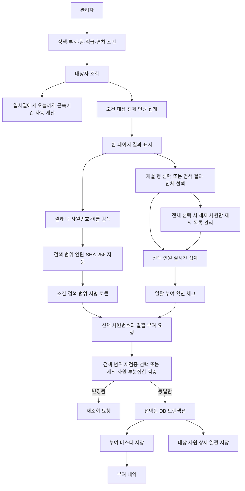

# 조건 기반 복지연차 일괄 부여

기존 MySQL 사원 데이터를 부서·팀·직급·입사일·근속기간으로 조회하고, 조건에 해당하는 전체 직원에게 실제 사내 복지연차를 일괄 부여하는 Django 애플리케이션입니다.

운영 MySQL 모드에는 임의 데이터를 넣지 않습니다. 별도로 분리된 데모 모드에서는 로컬 SQLite에 샘플 사원 800명과 샘플 정책 3건을 생성해 조회부터 저장까지 전체 기능을 확인할 수 있습니다. MySQL과 데모를 모두 끄면 빈 화면만 실행됩니다.

## 주요 기능

- 한 줄에 배치된 부서·업무팀·직급·연차 조건 조회
- 선택 연차의 1년 구간만 조회(예: 3년은 3년 0개월~3년 11개월)
- 입사일부터 오늘까지의 완료 근속기간 서버 자동 계산
- 대상자 조건이 없으면 전체 재직 데이터 조회 및 안내 메시지 표시
- 잘못된 조건 메시지가 표시돼도 대상자 조회 버튼 재사용 가능
- 조건과 일치하는 전체 재직자 수 서버 집계
- 조회 결과 내 사원번호 또는 사원이름 검색
- 서버 페이지네이션으로 일부 행만 표시
- 조회 결과의 체크박스로 한 명 또는 여러 명을 직접 선택
- 선택된 직원 오른쪽의 `전체 선택` 체크박스로 현재 검색 결과 전체를 한 번에 선택·해제
- 전체 선택 후 개별 행을 해제하면 해당 직원만 제외하고 나머지 선택 유지
- 체크된 인원 수를 대상자 요약과 최종 부여 영역에 실시간 반영
- 조회된 전체 대상자 부여 확인 체크 후에만 저장 버튼 활성화
- 검색·조건 범위 안에서 체크된 직원에게만 일괄 부여
- MySQL의 활성 복지연차 정책명과 부여 일수 사용
- 부여 조건, 정책, 대상 인원, 일수, 적용일, 처리일시, 처리자 저장
- 배치별 대상 사원 상세 저장
- 저장 직전 대상 인원과 SHA-256 대상 지문 재검증
- 중복 요청 키로 이중 클릭과 재전송 방지
- 부여 내역에서 대상 인원 클릭 시 배치 대상 사원번호 확인
- 부여 내역의 저장 조건을 코드나 JSON이 아닌 자연어로 표시
- MySQL 미마운트 상태에서도 빈 UI 실행 가능
- 운영 MySQL과 격리된 800명 로컬 데모 모드
- 관리 명령으로 연결·테이블·컬럼 매핑 검증

## 최근 반영 내용 (2026-08-28)

- 기존 `세부 조건` 명칭을 `연차`로 변경했습니다.
- 부서·업무팀·직급·연차 선택 상자를 첫 번째 행에 나란히 배치했습니다. 화면 폭이 좁아지면 반응형 레이아웃에 따라 자동으로 줄바꿈됩니다.
- 연차 조건을 `N년 이상` 방식에서 정확한 1년 구간 방식으로 변경했습니다. 예를 들어 `3년`은 완료 근속기간 36~47개월만 조회하며 4년차 이상은 포함하지 않습니다.
- 기본 데모 사원 수를 300명에서 800명으로 확대했습니다. 사원번호는 `DEMO000001`부터 `DEMO000800`까지 생성됩니다.
- 부여 내역의 `대상 인원`을 펼치면 실제 대상 사원번호를 확인할 수 있도록 변경했습니다.
- 부여 내역의 조건을 내부 코드나 JSON 대신 `부서: 경영지원부`, `연차: 3년 ~ 3년 11개월`과 같은 자연어로 표시하도록 변경했습니다.
- 조회 당시의 부서명·팀명·직급명을 조건 스냅샷에 함께 보관합니다. 이전 형식으로 저장된 내역은 현재 선택값 매핑과 기존 조건 의미를 사용해 호환 표시합니다.
- 사원번호 또는 이름으로 결과를 검색한 뒤 각 행의 체크박스로 실제 부여 대상을 선택할 수 있도록 변경했습니다.
- 여러 행을 선택하면 선택 인원이 화면의 요약·부여 대상·확인 문구에 즉시 반영됩니다.
- 대상자를 선택해도 확인 체크박스를 선택하기 전에는 `선택 대상자에게 일괄 부여` 버튼이 비활성화됩니다.
- 서버는 제출된 사원번호가 서명된 조회·검색 범위에 포함되는지 다시 검증하고, 체크된 사원만 저장합니다.
- 전체 선택은 현재 페이지가 아니라 조건·검색에 해당하는 모든 페이지에 적용됩니다.
- 전체 선택 후 개별 해제한 사원은 제외 목록으로 관리합니다. 예를 들어 300명 전체 선택 후 2명을 해제하면 298명 선택을 유지합니다.
- 부분 해제 상태에서 `전체 선택`을 다시 누르면 제외 목록을 초기화해 전체 인원으로 돌아가고, 다시 해제하면 선택 인원이 0명이 됩니다.

## 화면 구성

화면은 제공된 디자인을 기준으로 네이비 상단 헤더, 좌측 메뉴와 세 단계 작업 카드로 구성합니다.

1. 대상자 조건 설정
2. 대상자 조회 결과와 결과 내 직원 검색
3. 복지연차 일괄 부여 확인 및 저장

`부여 내역` 메뉴에서는 저장된 조건, 대상 인원, 부여 일수와 처리일을 확인합니다. 대상 인원은 펼쳐서 실제 사원번호 목록을 볼 수 있고, 조건은 부서명·팀명·직급명·연차처럼 사람이 바로 읽을 수 있는 문장으로 표시됩니다.

## 처리 흐름



## 폴더 구조

```text
leave_management/
├─ manage.py
├─ requirements.txt
├─ run_demo.ps1
├─ .env.example
├─ config/
│  ├─ settings.py
│  ├─ urls.py
│  └─ wsgi.py
├─ presentation/
│  ├─ forms.py
│  ├─ views.py
│  ├─ urls.py
│  ├─ tests.py
│  ├─ templates/presentation/
│  │  ├─ base.html
│  │  ├─ welfare_leave_grant.html
│  │  └─ welfare_leave_history.html
│  └─ static/presentation/
│     ├─ css/leave_management.css
│     └─ js/welfare_leave_selection.js
├─ service/
│  └─ welfare_leave_service.py
└─ repository/
   ├─ models.py
   ├─ employee_repository.py
   ├─ welfare_leave_repository.py
   ├─ mount_repository.py
   └─ management/commands/
      ├─ check_mysql_mount.py
      └─ prepare_demo.py
```

`crawling`, `crawling_bronze`, `reference`, `test` 폴더는 이 애플리케이션에서 수정하거나 참조하지 않습니다.

## 설치

```powershell
cd leave_management
py -3.14 -m venv .venv
.\.venv\Scripts\Activate.ps1
python -m pip install -r requirements.txt
Copy-Item .env.example .env
```

## 실행 모드

| `DEMO_MODE` | `MYSQL_MOUNTED` | 동작 |
|---|---|---|
| `false` | `false` | 데이터 없는 UI 점검 모드 |
| `true` | `false` | 로컬 SQLite의 800명 데모 모드 |
| `false` | `true` | 실제 MySQL 운영 연동 모드 |

두 값을 동시에 `true`로 설정하면 잘못된 DB 저장을 막기 위해 서버가 시작되지 않습니다.

데모 사원 수의 기본값은 `.env.example`의 다음 설정으로 관리합니다.

```env
DEMO_EMPLOYEE_COUNT=800
```

값을 변경한 뒤 `prepare_demo`를 다시 실행하면 동일한 사원번호는 갱신되고 필요한 추가 사원만 생성되므로 중복 행이 생기지 않습니다.

## 800명 데모 실행

PowerShell에서 다음 스크립트를 실행하는 방법이 가장 간단합니다.

```powershell
cd leave_management
powershell -ExecutionPolicy Bypass -File .\run_demo.ps1
```

`run_demo.ps1`은 활성 Python, 프로젝트 `.venv`, 로컬 Python 순으로 Django 실행 환경을 찾아 다음 작업을 수행합니다.

1. 현재 프로세스에 `DEMO_MODE=true`, `MYSQL_MOUNTED=false` 적용
2. `prepare_demo`로 로컬 `demo.sqlite3` 준비
3. `DEMO000001`~`DEMO000800` 사원과 샘플 정책 3건 저장
4. Django 개발 서버 실행

브라우저에서 `http://127.0.0.1:8000/`에 접속합니다. 부서·팀·직급·연차·부여 기준을 선택해 대상자를 조회할 수 있습니다. 아무 대상자 조건도 선택하지 않으면 전체 사원 800명을 조회합니다. 결과에서 한 명 이상을 체크하고 확인 체크박스를 선택하면 체크된 사원만 일괄 부여됩니다. 결과와 부여 내역은 `demo.sqlite3`에 저장됩니다.

데모 데이터의 특징:

- 사원번호: `DEMO000001`~`DEMO000800`
- 5개 부서, 15개 팀, 5개 직급
- 2012~2025년 사이의 입사일
- 이름에 `(샘플)`이 표시된 복지연차 정책 3건
- 실제 MySQL에는 접속하거나 데이터를 저장하지 않음
- 초기화 명령을 다시 실행해도 같은 사원번호와 정책을 갱신하므로 중복 생성되지 않음

수동으로 실행하려면 같은 PowerShell 창에서 다음과 같이 설정합니다.

```powershell
$env:DEMO_MODE="true"
$env:MYSQL_MOUNTED="false"
$env:WELFARE_OPERATOR_ID="demo-admin"
python manage.py prepare_demo
python manage.py runserver
```

`demo.sqlite3`은 `.gitignore`에 포함되어 팀 저장소에 커밋되지 않습니다. 데모 화면 상단에도 실제 MySQL 데이터가 아니라는 안내가 표시됩니다.

## MySQL 마운트 전 빈 화면 실행

`.env`의 기본값인 `DEMO_MODE=false`, `MYSQL_MOUNTED=false`를 유지합니다.

```powershell
python manage.py check
python manage.py runserver
```

브라우저에서 `http://127.0.0.1:8000/`에 접속합니다. 이 상태에서는 임의 데이터를 만들지 않으므로 대상 인원은 `-`, 목록은 빈 상태로 표시되고 조회·저장 버튼은 비활성화됩니다.

## 실제 MySQL 마운트 순서

### 1. 접속정보 입력

`.env`에 실제 값을 입력합니다.

```env
MYSQL_DATABASE=실제_데이터베이스명
MYSQL_USER=실제_계정
MYSQL_PASSWORD=실제_비밀번호
MYSQL_HOST=실제_MySQL_주소
MYSQL_PORT=3306
```

### 2. 물리 테이블·컬럼 매핑

`.env.example`의 다음 영역을 실제 스키마에 맞춥니다.

- `MYSQL_EMPLOYEE_*`: 사원 정보
- `MYSQL_POLICY_*`: 복지연차 정책
- `MYSQL_BATCH_*`: 일괄 부여 마스터
- `MYSQL_TARGET_*`: 대상 사원 상세

### 3. 처리자 식별자 설정

실제 로그인 연동 전까지 처리 관리자 ID를 환경변수로 주입합니다.

```env
WELFARE_OPERATOR_ID=실제_처리자_ID
```

값이 비어 있으면 조회는 가능하지만 일괄 부여 버튼은 비활성화됩니다.

### 4. 마운트 활성화

```env
DEMO_MODE=false
MYSQL_MOUNTED=true
```

### 5. 연결과 스키마 검증

먼저 접속만 확인합니다.

```powershell
python manage.py check_mysql_mount --connection-only
```

그다음 필수 테이블과 모든 매핑 컬럼을 확인합니다.

```powershell
python manage.py check_mysql_mount
```

누락된 항목은 다음 형식으로 표시됩니다.

```text
누락: table:<테이블명>
누락: column:<테이블명>.<컬럼명>
```

접속 비밀번호는 점검 출력이나 애플리케이션 로그에 표시하지 않습니다.

### 6. 서버 실행

```powershell
python manage.py runserver
```

## MySQL 논리 계약

실제 물리명은 `.env`로 변경할 수 있습니다. 모든 모델은 `managed = False`이므로 Django가 업무 테이블을 생성·변경·삭제하지 않습니다.

### 사원 정보

| 논리 필드 | 용도 |
|---|---|
| `employee_no` | 사원 식별 및 결과 내 검색 |
| `employee_name` | 사원이름 검색 및 표시 |
| `department_code`, `department_name` | 부서 조건 |
| `team_code`, `team_name` | 팀 조건 |
| `position_code`, `position_name` | 직급 조건 |
| `hire_date` | 입사일과 근속기간 계산 |
| `active_yn` | 재직자 제한 |

### 복지연차 정책

| 논리 필드 | 용도 |
|---|---|
| `policy_code` | 복지연차 정책 식별자 |
| `policy_name` | 화면 및 이력 표시명 |
| `criteria_name` | 사내 부여 기준명 |
| `criteria_detail` | 세부 기준 설명 |
| `grant_days` | 서버가 확정하는 실제 부여 일수 |
| `active_yn` | 현재 사용 가능한 정책 제한 |

부여 일수는 브라우저가 전송한 값을 사용하지 않고 정책 테이블에서 다시 조회합니다.

### 일괄 부여 마스터

| 논리 필드 | 용도 |
|---|---|
| `batch_id` | 일괄 실행 식별자 |
| `policy_code`, `policy_name` | 처리 당시 정책 스냅샷 |
| `condition_snapshot` | JSON 문자열 형태의 조회 조건 |
| `target_count` | 체크박스로 선택해 실제 저장한 대상 인원 |
| `grant_days` | 실제 부여 일수 |
| `apply_date` | 복지연차 적용일 |
| `processed_at` | 실제 처리 시각 |
| `processed_by` | 처리 관리자 |
| `status` | 처리 상태 |
| `request_key` | 중복 요청 방지 키 |

`request_key`에는 DB Unique 제약이 필요합니다.

### 대상 사원 상세

| 논리 필드 | 용도 |
|---|---|
| `target_id` | 상세 행 식별자 |
| `batch_id` | 마스터 배치 연결 |
| `employee_no` | 실제 부여 대상 사원 |
| `grant_days` | 대상별 부여 일수 |
| `status` | 대상별 성공·실패 상태 |
| `failure_reason` | 실패 사유 |
| `processed_at` | 대상 처리 시각 |

`batch_id + employee_no`에는 DB Unique 제약이 필요합니다. 현재 계약에서는 이 상세 테이블이 실제 복지연차 부여 원장이며, 별도의 잔액 또는 원장 테이블이 제공되면 `WelfareLeaveGrantRepository` 트랜잭션에 해당 저장을 추가합니다.

## 부여 내역 확인 방식

- `대상 인원`의 `N명`을 누르면 해당 배치에 저장된 사원번호 목록이 펼쳐집니다.
- `조건`의 `보기`를 누르면 부서·업무팀·직급·연차가 자연어로 표시됩니다.
- 화면에는 조건 스냅샷의 내부 코드, 입사일 경계값 또는 원본 JSON을 직접 노출하지 않습니다.
- 조회 당시 표시명을 스냅샷에 저장하므로 이후 조직 코드의 표시명이 바뀌더라도 신규 부여 내역의 당시 조건을 보존할 수 있습니다.
- 기존 저장 건에 표시명 스냅샷이 없으면 현재 부서·팀·직급 목록에서 코드에 대응하는 이름을 찾아 표시합니다.

## 결과 내 검색과 대상자 선택 범위

결과 내 검색은 최초 부서·팀·직급·연차 조건 안에서 사원번호 또는 사원이름으로 선택 후보를 좁힙니다. 화면의 행 체크박스는 기본적으로 선택되지 않으며, 관리자가 직접 체크한 직원만 실제 부여 대상이 됩니다.

- 조건 대상 인원: 최초 조건 QuerySet의 `count()`
- 검색 후보 범위: 최초 조건 + 결과 내 검색어
- 화면 표시 목록: 검색 후보 범위를 페이지 단위로 표시
- 개별 선택 범위: 현재 화면에서 직접 체크한 사원번호만 사용
- 전체 선택 범위: 현재 페이지와 관계없이 조건·검색에 해당하는 모든 사원 사용
- 전체 선택 후 해제: 해제한 사원번호만 제외 목록에 저장하고 나머지 전체 선택 유지
- 선택 인원 표시: 체크 상태가 바뀔 때마다 요약과 최종 부여 영역에 즉시 반영
- 선택 초기화: 새로운 검색 또는 페이지 이동 시 이전 체크 상태를 유지하지 않음

예를 들어 `DEMO000001`을 검색해 해당 행 하나를 체크하면 그 직원 한 명만 대상이 됩니다. 이름 검색으로 여러 직원이 표시된 경우 여러 행을 체크하면 체크된 직원들만 함께 부여됩니다.

`전체 선택` 체크박스는 화면에 표시된 한 페이지뿐 아니라 현재 검색 후보 범위 전체를 선택합니다. 검색 결과가 300명이면 한 페이지에 20명만 보여도 선택 인원은 300명입니다. 이 상태에서 보이는 두 행을 해제하면 298명이 유지되며 전체 선택 체크박스는 부분 선택 상태가 됩니다. 전체 선택을 다시 누르면 제외 목록이 초기화되어 300명이 되고, 다시 해제하면 0명이 됩니다.

## 대상자 조건과 근속기간 계산

대상자 조회 화면은 다음 다섯 가지 선택값만 사용합니다. 부서·업무팀·직급·연차는 같은 행에 배치되며, 부여 기준은 다음 행에서 선택합니다.

- 부서
- 업무팀
- 직급
- 연차: 전체, 1년, 3년, 5년, 10년
- 부여 기준

최소·최대 근속개월이나 입사일 범위를 관리자가 직접 입력하지 않습니다. 연차를 선택하면 서버가 실행 당일을 기준으로 입사일과 비교해 완료된 근속기간을 계산합니다. 선택값은 최소 근속기간이 아니라 정확한 1년 구간입니다.

- `1년`: 1년 0개월~1년 11개월
- `3년`: 3년 0개월~3년 11개월
- `5년`: 5년 0개월~5년 11개월
- `10년`: 10년 0개월~10년 11개월

예를 들어 오늘이 `2026-08-28`일 때 `3년`은 완료 근속개월이 36~47개월인 사원만 의미합니다. 입사일 조건으로는 `2022-08-28`보다 늦고 `2023-08-28`보다 이른 날짜 또는 같은 날짜입니다. 따라서 4년차 이상 직원은 `3년` 조회에 포함되지 않습니다.

부서·팀·직급·연차 조건을 추가하면 모든 조건을 동시에 만족하는 사원만 남습니다. 조건을 하나도 선택하지 않으면 전체 재직 데이터를 조회하고 화면에 전체 조회임을 알리는 메시지를 표시합니다. 잘못된 선택값이 전달된 경우에도 오류 메시지만 표시하며 조회 버튼은 비활성화하지 않습니다.

부여 기준을 선택하지 않아도 대상자 조회는 가능합니다. 실제 일괄 부여 버튼은 활성 정책 선택, 한 명 이상의 행 체크, `조회된 전체 대상자에게 일괄 부여함을 확인합니다.` 확인 체크를 모두 완료해야 활성화됩니다.

## 일괄 부여 안전장치

- 전체 조회 시 안내 메시지와 대상 인원 명시
- 활성 재직자만 조회
- 서명된 조건·검색어·검색 후보 인원·SHA-256 지문 사용
- 저장 직전에 동일 조건과 검색어로 선택 가능 범위를 다시 조회
- 검색 후보 인원 또는 지문이 변경되면 저장 중단 후 재조회 요청
- 제출된 각 사원번호가 서명된 조회·검색 범위의 부분집합인지 검증
- 전체 선택 모드의 제외 사원번호도 조회·검색 범위의 부분집합인지 검증
- 중복으로 제출된 사원번호 제거
- 개별 선택은 체크된 사원만, 전체 선택은 검색 범위에서 해제한 사원을 제외한 나머지만 저장
- 정책 코드와 부여 일수를 현재 활성 데이터 소스에서 재조회
- CSRF 검증
- 요청 키 중복 확인
- 마스터·대상 상세를 `transaction.atomic()`으로 저장
- 저장 직전 재검증한 사원번호 집합을 고정하고 설정된 크기로 `bulk_create`
- 브라우저에는 검색 후보 전체 목록을 전달하지 않고 한 페이지만 표시

## 계층별 함수

### Presentation

- `TargetConditionForm.__init__()`: 실제 부서·팀·직급·정책 선택값 등록
- `TargetConditionForm`: 조직·정책·사전 정의된 연차 구간 선택값 검증
- `ResultSearchForm`: 결과 내 사원번호·이름 검색어 검증
- `EmployeeNumberListField`: 체크박스로 제출된 여러 사원번호의 공백·중복 제거 및 형식 검증
- `BulkGrantForm`: 서명 토큰·개별/전체 선택 모드·선택/제외 사원번호·적용일·전체 부여 확인 검증
- `_policy_choices()`: 정책 모델을 Select 선택값으로 변환
- `_preserved_condition_fields()`: 결과 검색·페이지 이동 중 조건 보존
- `welfare_leave_grant_view()`: 조건 조회와 일괄 부여 요청 처리
- `_condition_display_labels()`: 조회 당시 코드값에 대응하는 화면 표시명을 조건 스냅샷에 보존
- `grant_history_view()`: 대상 사원번호와 자연어 조건을 결합한 부여 내역 표시

### Service

- `get_mount_status()`: 빈 화면·데모·MySQL 데이터 소스 상태 반환
- `get_filter_options()`: 실제 조직·직급 선택값 조회
- `get_active_policies()`: 활성 복지연차 정책 조회
- `subtract_months()`: 근속기간 필터용 월 단위 날짜 계산
- `calculate_tenure_months()`: 완료된 근속 개월 수 계산
- `format_tenure()`: 근속기간을 년·개월 형식으로 표시
- `normalize_condition()`: 선택한 연차를 오늘 기준 12개월 입사일 구간으로 자동 변환
- `serialize_condition()`, `deserialize_condition()`: 조건 날짜 직렬화·복원
- `format_history_condition_lines()`: 저장 조건을 자연어 부서명·팀명·직급명·연차로 변환
- `calculate_target_fingerprint()`: 조회·검색 후보 사원번호 SHA-256 계산
- `calculate_employee_number_fingerprint()`: 고정된 사원번호 집합 SHA-256 계산
- `search_targets()`: 조건 전체 집계, 결과 내 검색, 페이지네이션, 검색 범위 서명 토큰 생성
- `grant_welfare_leave()`: 검색 범위와 선택·제외 부분집합 재검증 후 최종 대상만 트랜잭션 저장
- `get_grant_history()`: 최근 부여 배치에 대상 사원번호와 자연어 조건을 결합해 반환

### Repository

- `DatabaseMountRepository.check()`: 마운트·접속·스키마 상태 확인
- `DatabaseMountRepository.find_missing_schema_items()`: 누락 테이블·컬럼 탐지
- `EmployeeRepository.build_target_queryset()`: 전체 조건 대상 QuerySet 생성
- `EmployeeRepository.search_within_results()`: 화면 표시용 직원 검색
- `EmployeeRepository.filter_by_employee_numbers()`: 조회·검색 범위에서 체크된 사원번호만 제한
- `EmployeeRepository.exclude_employee_numbers()`: 전체 선택 범위에서 수동 해제한 사원번호 제외
- `EmployeeRepository.iter_employee_numbers()`: 사원번호 스트리밍
- `EmployeeRepository.list_departments()`: 실제 부서 선택값 조회
- `EmployeeRepository.list_teams()`: 실제 팀 선택값 조회
- `EmployeeRepository.list_positions()`: 실제 직급 선택값 조회
- `WelfareLeavePolicyRepository.list_active()`: 활성 정책 목록 조회
- `WelfareLeavePolicyRepository.get_active()`: 활성 정책 단건 조회
- `WelfareLeaveGrantRepository.get_by_request_key()`: 중복 요청 확인
- `WelfareLeaveGrantRepository.create_batch()`: 일괄 부여 마스터 생성
- `WelfareLeaveGrantRepository.bulk_create_targets()`: 대상 상세 분할 저장
- `WelfareLeaveGrantRepository.history_queryset()`: 최근 부여 내역 조회
- `WelfareLeaveGrantRepository.employee_numbers_by_batch_ids()`: 배치별 대상 사원번호 목록 조회
- `prepare_demo.Command`: 데모 SQLite 스키마와 샘플 데이터 준비
- `build_demo_employee()`: 순번으로 재현 가능한 데모 사원 필드 생성

## 테스트

MySQL 미마운트 상태에서 실행할 수 있습니다.

```powershell
python manage.py check
python manage.py test presentation
```

현재 테스트 범위:

- 빈 대상 조건 전체 조회 허용
- 수동 입사일·최소·최대 근속 입력 제거 확인
- 사전 정의되지 않은 근속 조건 차단
- 한 명 이상 대상 선택 필수 검증
- 여러 체크박스 사원번호의 순서 유지와 중복 제거
- 전체 선택 모드에서 제외 목록 없이도 정상 처리
- 전체 300명 중 2명 해제 시 298명만 저장
- 부여 확인 체크 필수 검증
- 오늘 기준 연차의 12개월 입사일 구간 변환
- 선택한 연차가 상위 연차 직원을 포함하지 않는지 확인
- 완료 근속개월 계산
- 월말 날짜 보정
- 부여 내역의 코드값을 자연어 조건으로 변환
- 선택한 사원만 대상 상세에 저장되는지 확인
- 개별 선택 인원과 검색어의 자연어 이력 표시
- 전체 선택 후 제외 인원과 최종 선택 인원의 자연어 이력 표시
- 데모 사원 800명 생성 확인
- MySQL 미마운트 일괄 부여 화면 실행
- MySQL 미마운트 부여 내역 화면 실행

2026-08-28 기준으로 Django 시스템 검사와 `presentation` 테스트 22건이 모두 통과했습니다. 데모 브라우저에서는 `800명 전체 선택 → 2명 해제 → 798명 → 전체 재선택 → 800명 → 전체 해제 → 0명` 흐름과 확인 체크 전후 버튼 상태를 검증했습니다. 또한 `DEMO000001~009` 검색 결과 9명에서 2명을 해제한 뒤 `DEMO000003~009` 7명만 저장되고, 부여 내역에 `검색 결과 전체에서 2명 제외, 7명 선택`으로 기록되는 것을 확인했습니다.

실제 MySQL 연동 테스트는 마운트 후 별도의 검증 DB 또는 승인된 테스트 계정으로 수행합니다.

데모 통합 확인은 `run_demo.ps1` 또는 아래 초기화 명령으로 수행합니다.

```powershell
$env:DEMO_MODE="true"
$env:MYSQL_MOUNTED="false"
python manage.py prepare_demo
```

정상 출력은 사원 `800명`, 복지연차 정책 `3건`입니다.

## 향후 복지연차 종류 확장

현재 코드는 복지연차 이름과 일수를 하드코딩하지 않고 정책 테이블의 활성 행을 읽습니다. 추후 사내 규정에 복지연차 종류가 추가되면 실제 정책 테이블에 승인된 데이터를 추가하고 필요한 판정 모듈만 확장할 수 있습니다.

향후 확장 가능한 정책 항목:

- 정책 적용 시작·종료일
- 부서 또는 직급별 정책 제한
- 근속기간 이외의 판정 방식
- 정책별 최대 부여 횟수
- 연도별 중복 부여 방지
- 승인 워크플로

운영 MySQL에는 승인되지 않은 임의 정책 데이터를 넣지 않습니다. 데모 정책은 로컬 SQLite에만 존재하며 이름에 `(샘플)`을 표시합니다.

## 운영 전 확인사항

- 실제 사원 테이블의 기본키와 컬럼 타입
- 입사일이 `DATE`인지 `DATETIME`인지
- 재직 상태 실제 값
- 실제 정책 테이블 존재 여부
- 마스터·상세 테이블의 PK·Unique 제약
- 별도의 연차 잔액·원장 테이블 반영 필요 여부
- 처리자 정보를 로그인 사용자로 가져올 방식
- 운영 MySQL 계정의 최소 조회·INSERT 권한
- 부서·팀·직급·입사일·재직 상태 인덱스

위 항목이 확정되면 `.env` 매핑과 Repository만 실제 스키마에 맞춰 최종 조정합니다.
